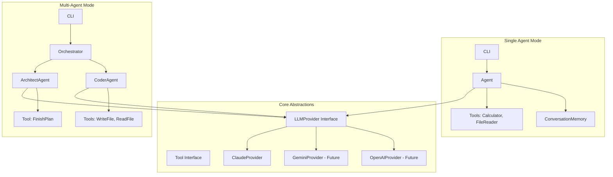
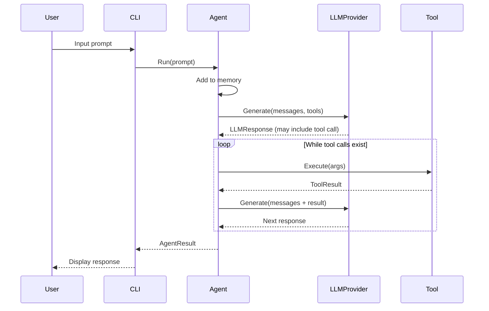
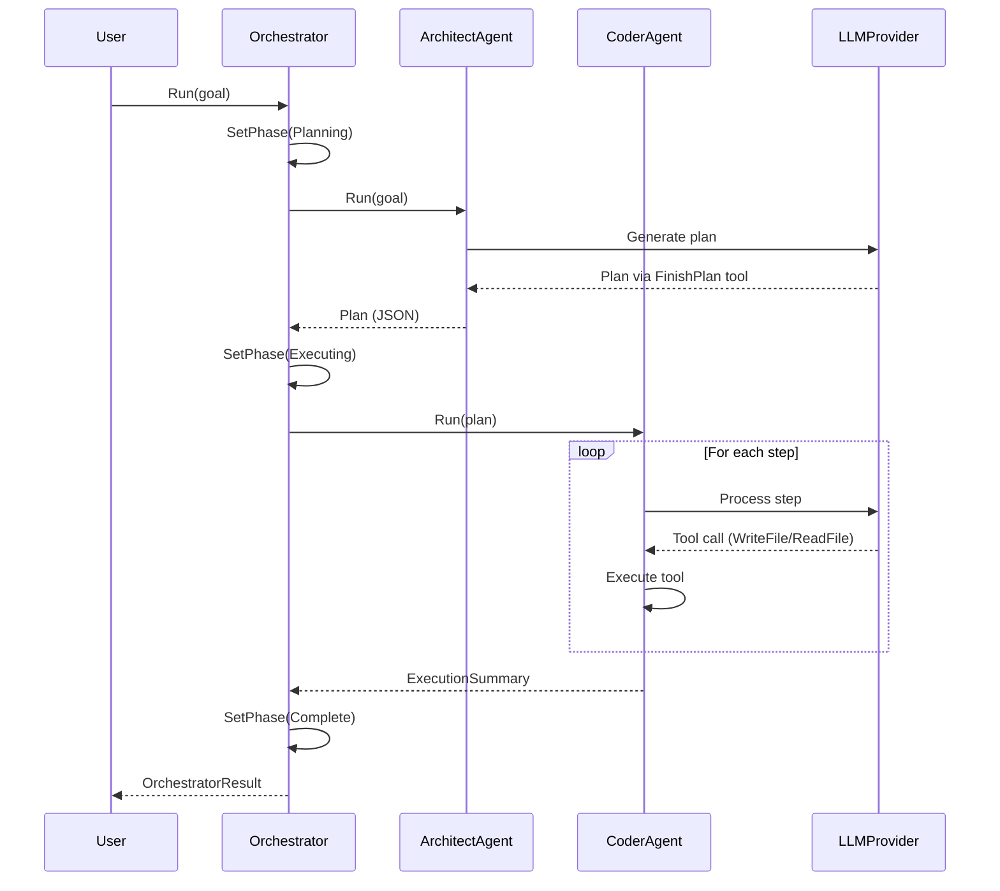
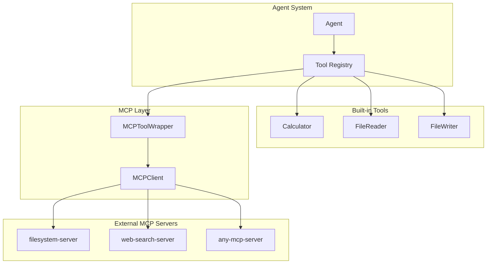

# Design Document: Agentic System POC

## Overview

This design describes a Proof of Concept agentic system built in Go using a provider-agnostic LLM interface. The system demonstrates two core patterns:

1. **Single Agent Pattern**: A basic agent implementing the Think -> Act -> Observe loop with tool-calling capabilities
2. **Multi-Agent Pattern**: An Architect/Coder coordination pattern with an orchestrator managing workflow

The primary LLM provider is Anthropic's Claude API, with the architecture supporting easy addition of other providers (Gemini, OpenAI). The architecture prioritizes simplicity, extensibility, and learning while documenting challenges and trade-offs encountered.

## Architecture



### Component Interaction Flow

**Single Agent Flow:**


**Multi-Agent Flow:**


## Components and Interfaces

### 1. LLMProvider Interface

The core abstraction enabling multi-provider support.

```go
// LLMProvider defines the interface for LLM communication.
type LLMProvider interface {
    Generate(ctx context.Context, req GenerateRequest) (*LLMResponse, error)
    Name() string
}

type GenerateRequest struct {
    Messages     []Message
    Tools        []ToolDefinition
    SystemPrompt string
}
```

### 2. ClaudeProvider

Concrete implementation for Anthropic's Claude API.

```go
type ClaudeProvider struct {
    apiKey  string
    model   string
    client  *http.Client
    baseURL string
}

func NewClaudeProvider() (*ClaudeProvider, error) {
    apiKey := os.Getenv("ANTHROPIC_API_KEY")
    if apiKey == "" {
        return nil, errors.New("ANTHROPIC_API_KEY not set")
    }
    return &ClaudeProvider{
        apiKey:  apiKey,
        model:   "claude-sonnet-4-20250514",
        client:  &http.Client{Timeout: 60 * time.Second},
        baseURL: "https://api.anthropic.com/v1",
    }, nil
}

func (c *ClaudeProvider) Name() string { return "claude" }
```

### 3. Tool Interface

```go
type Tool interface {
    Name() string
    Description() string
    Parameters() map[string]interface{}
    Execute(ctx context.Context, args map[string]interface{}) (*ToolResult, error)
}
```


### 4. Tool Implementations

```go
// CalculatorTool performs basic arithmetic.
type CalculatorTool struct{}

func (c *CalculatorTool) Name() string { return "calculator" }
func (c *CalculatorTool) Description() string {
    return "Performs arithmetic: add, subtract, multiply, divide"
}

// FileReaderTool reads file contents.
type FileReaderTool struct {
    basePath string
}

// FileWriterTool writes content to files.
type FileWriterTool struct {
    basePath string
}

// FinishPlanTool captures the Architect's completed plan.
type FinishPlanTool struct {
    capturedPlan *Plan
}
```

### 5. ConversationMemory

```go
type ConversationMemory struct {
    messages []Message
    mu       sync.RWMutex
}

func NewConversationMemory() *ConversationMemory {
    return &ConversationMemory{messages: make([]Message, 0)}
}

func (m *ConversationMemory) AddMessage(role, content string)
func (m *ConversationMemory) AddToolResult(toolCallID, toolName, result string)
func (m *ConversationMemory) GetMessages() []Message
func (m *ConversationMemory) Clear()
```

### 6. Agent

Core agent implementing the Think -> Act -> Observe loop.

```go
type Agent struct {
    provider      LLMProvider
    tools         map[string]Tool
    systemPrompt  string
    maxIterations int
}

type AgentConfig struct {
    Provider      LLMProvider
    Tools         []Tool
    SystemPrompt  string
    MaxIterations int
}

func NewAgent(cfg AgentConfig) *Agent

func (a *Agent) Run(ctx context.Context, input string, memory *ConversationMemory) (*AgentResult, error) {
    // 1. Add user input to memory
    // 2. Loop until max iterations:
    //    a. Call LLM with history and tools
    //    b. If no tool calls, return response
    //    c. Execute tool calls, add results to memory
    // 3. Return error if max iterations reached
}
```

### 7. Specialized Agents

```go
func NewArchitectAgent(provider LLMProvider) (*Agent, *FinishPlanTool)
func NewCoderAgent(provider LLMProvider, basePath string) *Agent
```

### 8. Orchestrator

```go
type Orchestrator struct {
    provider LLMProvider
    basePath string
    state    WorkflowState
    mu       sync.RWMutex
}

func NewOrchestrator(provider LLMProvider, basePath string) *Orchestrator

func (o *Orchestrator) Run(ctx context.Context, goal string) (*OrchestratorResult, error) {
    // 1. Set phase to Planning, invoke Architect
    // 2. Capture plan from FinishPlanTool
    // 3. Set phase to Executing, invoke Coder with plan
    // 4. Return result with actions taken
}

func (o *Orchestrator) State() WorkflowState
```

### 9. CLI

```go
type CLI struct {
    provider LLMProvider
    output   io.Writer
    input    *bufio.Scanner
}

func NewCLI(provider LLMProvider) *CLI
func (c *CLI) RunSingleAgentMode() error
func (c *CLI) RunMultiAgentMode() error
```

## Data Models

```go
type Message struct {
    Role       string
    Content    string
    ToolCallID string
    ToolName   string
}

type ToolCall struct {
    ID        string
    Name      string
    Arguments map[string]interface{}
}

type ToolResult struct {
    Success bool
    Output  string
    Error   string
}

type LLMResponse struct {
    Text      string
    ToolCalls []ToolCall
}

func (r *LLMResponse) HasToolCalls() bool

type ToolDefinition struct {
    Name        string
    Description string
    Parameters  map[string]interface{}
}

type PlanStep struct {
    Description string                 `json:"description"`
    Action      string                 `json:"action"`
    Parameters  map[string]interface{} `json:"parameters"`
}

type Plan struct {
    Goal  string     `json:"goal"`
    Steps []PlanStep `json:"steps"`
}

func (p *Plan) ToJSON() (string, error)
func ParsePlan(jsonStr string) (*Plan, error)

type AgentResult struct {
    Response      string
    ToolCallsMade []ToolCall
    Iterations    int
}

type WorkflowPhase string

const (
    PhaseIdle      WorkflowPhase = "idle"
    PhasePlanning  WorkflowPhase = "planning"
    PhaseExecuting WorkflowPhase = "executing"
    PhaseComplete  WorkflowPhase = "complete"
    PhaseFailed    WorkflowPhase = "failed"
)

type WorkflowState struct {
    Phase        WorkflowPhase
    CurrentAgent string
    Plan         *Plan
    Error        string
}

type OrchestratorResult struct {
    Success      bool
    Plan         *Plan
    ActionsTaken []string
    Summary      string
    Error        string
}
```

## MCP Integration (Future Phase)

MCP (Model Context Protocol) enables connecting to external tool servers. This keeps the core simple while allowing future expansion via the open-source MCP ecosystem.

### MCP Architecture



### MCP Components

```go
// MCPClient handles communication with an MCP server.
type MCPClient interface {
    Connect(ctx context.Context) error
    ListTools(ctx context.Context) ([]MCPToolInfo, error)
    CallTool(ctx context.Context, name string, args map[string]interface{}) (*ToolResult, error)
    Close() error
}

// StdioMCPClient spawns an MCP server as a subprocess.
type StdioMCPClient struct {
    command string
    args    []string
    env     map[string]string
    cmd     *exec.Cmd
    stdin   io.WriteCloser
    stdout  io.ReadCloser
}

func NewStdioMCPClient(command string, args []string, env map[string]string) *StdioMCPClient

// MCPToolWrapper adapts an MCP tool to the Tool interface.
type MCPToolWrapper struct {
    client MCPClient
    info   MCPToolInfo
}

func (w *MCPToolWrapper) Name() string        { return w.info.Name }
func (w *MCPToolWrapper) Description() string { return w.info.Description }
func (w *MCPToolWrapper) Parameters() map[string]interface{} { return w.info.InputSchema }
func (w *MCPToolWrapper) Execute(ctx context.Context, args map[string]interface{}) (*ToolResult, error) {
    return w.client.CallTool(ctx, w.info.Name, args)
}

// MCPToolInfo represents tool metadata from an MCP server.
type MCPToolInfo struct {
    Name        string
    Description string
    InputSchema map[string]interface{}
}
```

### MCP Configuration

```go
// MCPConfig defines MCP server connections.
type MCPConfig struct {
    Servers map[string]MCPServerConfig `json:"mcpServers"`
}

type MCPServerConfig struct {
    Command     string            `json:"command"`
    Args        []string          `json:"args"`
    Env         map[string]string `json:"env"`
    Disabled    bool              `json:"disabled"`
    AutoApprove []string          `json:"autoApprove"`
}

func LoadMCPConfig(path string) (*MCPConfig, error)
```

Example config (`mcp.json`):
```json
{
  "mcpServers": {
    "filesystem": {
      "command": "npx",
      "args": ["-y", "@modelcontextprotocol/server-filesystem", "/tmp/workspace"],
      "disabled": false
    }
  }
}
```

### MCP Manager

```go
// MCPManager handles multiple MCP server connections.
type MCPManager struct {
    clients map[string]MCPClient
    tools   map[string]*MCPToolWrapper
    mu      sync.RWMutex
}

func NewMCPManager() *MCPManager
func (m *MCPManager) LoadFromConfig(cfg *MCPConfig) error
func (m *MCPManager) GetTools() []Tool  // Returns all MCP tools as Tool interface
func (m *MCPManager) Shutdown() error
```

### Integration with Agent

The Agent's tool registry accepts both built-in tools and MCP-wrapped tools:

```go
func NewAgentWithMCP(cfg AgentConfig, mcpManager *MCPManager) *Agent {
    agent := NewAgent(cfg)
    
    // Add MCP tools to the agent's tool registry
    for _, tool := range mcpManager.GetTools() {
        agent.RegisterTool(tool)
    }
    
    return agent
}
```

### MCP Protocol Messages

The stdio transport uses JSON-RPC 2.0:

```go
type JSONRPCRequest struct {
    JSONRPC string      `json:"jsonrpc"`
    ID      int         `json:"id"`
    Method  string      `json:"method"`
    Params  interface{} `json:"params,omitempty"`
}

type JSONRPCResponse struct {
    JSONRPC string          `json:"jsonrpc"`
    ID      int             `json:"id"`
    Result  json.RawMessage `json:"result,omitempty"`
    Error   *JSONRPCError   `json:"error,omitempty"`
}

type JSONRPCError struct {
    Code    int    `json:"code"`
    Message string `json:"message"`
}
```

### MCP Project Structure Addition

```
agentic-poc/
├── internal/
│   ├── mcp/
│   │   ├── client.go         # MCPClient interface
│   │   ├── stdio.go          # StdioMCPClient implementation
│   │   ├── wrapper.go        # MCPToolWrapper
│   │   ├── manager.go        # MCPManager
│   │   └── config.go         # Config loading
│   └── ...
├── mcp.json                  # MCP server configuration
└── ...
```

## Project Structure

```
agentic-poc/
├── cmd/
│   └── agent/
│       └── main.go           # CLI entry point
├── internal/
│   ├── provider/
│   │   ├── provider.go       # LLMProvider interface
│   │   └── claude.go         # Claude implementation
│   ├── tool/
│   │   ├── tool.go           # Tool interface
│   │   ├── calculator.go
│   │   ├── file_reader.go
│   │   ├── file_writer.go
│   │   └── finish_plan.go
│   ├── memory/
│   │   └── conversation.go
│   ├── agent/
│   │   ├── agent.go
│   │   ├── architect.go
│   │   └── coder.go
│   ├── orchestrator/
│   │   └── orchestrator.go
│   └── cli/
│       └── cli.go
├── docs/
│   └── wiki/
│       ├── README.md
│       ├── challenges/
│       ├── tradeoffs/
│       └── observations/
├── go.mod
└── README.md
```


## Correctness Properties

*A property is a characteristic or behavior that should hold true across all valid executions of a system—essentially, a formal statement about what the system should do. Properties serve as the bridge between human-readable specifications and machine-verifiable correctness guarantees.*

### Property 1: Conversation Memory Preserves Order and Content

*For any* sequence of messages added to ConversationMemory, the messages returned by GetMessages() SHALL appear in the same order they were added, with each message containing the exact role and content that was provided.

**Validates: Requirements 2.1, 2.2**

### Property 2: LLM Requests Include Full History

*For any* agent run with existing conversation history, the GenerateRequest sent to the LLMProvider SHALL include all messages from the ConversationMemory in order.

**Validates: Requirements 2.3**

### Property 3: Tool Definitions Are Complete

*For any* Tool implementation, calling Name(), Description(), and Parameters() SHALL return non-empty values, and Parameters() SHALL return a valid JSON Schema object.

**Validates: Requirements 3.1**

### Property 4: Tool Call Parsing Extracts Correct Data

*For any* LLMResponse containing tool calls, parsing SHALL extract the correct tool name, ID, and arguments map that matches the original response structure.

**Validates: Requirements 3.2**

### Property 5: Tool Execution Dispatches to Correct Tool

*For any* parsed ToolCall with a name matching a registered tool, the Agent SHALL invoke that tool's Execute method with the arguments from the ToolCall.

**Validates: Requirements 3.3**

### Property 6: Tool Results Are Fed Back to LLM

*For any* tool execution that completes (success or failure), the result SHALL be added to the conversation memory and included in the next LLM request.

**Validates: Requirements 3.4**

### Property 7: Calculator Produces Correct Results

*For any* valid arithmetic operation (add, subtract, multiply, divide) with numeric operands a and b, the CalculatorTool SHALL return the mathematically correct result. Division by zero SHALL return an error.

**Validates: Requirements 3.5**

### Property 8: File Reader Returns File Content or Error

*For any* file path, the FileReaderTool SHALL return the exact file content if the file exists and is readable, or a descriptive error if the file does not exist or is not readable.

**Validates: Requirements 3.6**

### Property 9: Tool Errors Do Not Crash the System

*For any* tool execution that returns an error, the Agent SHALL continue operation by sending the error message to the LLM rather than panicking or terminating.

**Validates: Requirements 3.7**

### Property 10: Agent Loop Continues While Tool Calls Exist

*For any* LLMResponse containing tool calls, the Agent loop SHALL execute those tools and make another LLM request, continuing until a response without tool calls is received or max iterations is reached.

**Validates: Requirements 4.2**

### Property 11: Agent Loop Terminates on Final Response

*For any* LLMResponse without tool calls, the Agent SHALL immediately return that response as the final result without making additional LLM requests.

**Validates: Requirements 4.3**

### Property 12: Max Iterations Prevents Infinite Loops

*For any* agent run that reaches the configured maxIterations without receiving a final response, the Agent SHALL return an error indicating max iterations exceeded.

**Validates: Requirements 4.4**

### Property 13: Plan Structure Contains Required Fields

*For any* Plan produced by the Architect agent, it SHALL have a non-empty Goal and at least one PlanStep, where each step has a non-empty Description and Action.

**Validates: Requirements 5.5**

### Property 14: Coder Returns Action Summary

*For any* successful Coder agent execution, the result SHALL include a list of all tool calls made during execution.

**Validates: Requirements 6.5**

### Property 15: Workflow Executes in Correct Sequence

*For any* Orchestrator run, the Architect agent SHALL be invoked before the Coder agent, and the Plan produced by Architect SHALL be passed to Coder as input.

**Validates: Requirements 7.2, 7.3, 7.4**

### Property 16: Workflow State Reflects Current Phase

*For any* point during Orchestrator execution, the WorkflowState.Phase SHALL accurately reflect whether the system is idle, planning, executing, complete, or failed.

**Validates: Requirements 7.5**

### Property 17: Workflow Stops on Agent Failure

*For any* agent error during Orchestrator execution, the workflow SHALL stop immediately, set phase to Failed, and return an error describing which agent failed and why.

**Validates: Requirements 7.6**

### Property 18: Plan JSON Round-Trip Preserves Data

*For any* valid Plan object, serializing to JSON with ToJSON() and then parsing with ParsePlan() SHALL produce a Plan equivalent to the original.

**Validates: Requirements 8.2, 8.3**

### Property 19: Invalid JSON Produces Descriptive Errors

*For any* invalid JSON string passed to ParsePlan(), the function SHALL return an error that describes what was wrong with the input (e.g., missing required field, invalid structure).

**Validates: Requirements 8.4, 8.5**

### Property 20: LLM Provider Errors Are Wrapped with Context

*For any* error returned by an LLMProvider, the calling code SHALL wrap it with additional context about what operation failed.

**Validates: Requirements 1.3**

### Property 21: MCP Tools Implement Tool Interface (Future Phase)

*For any* tool discovered from an MCP server, the MCPToolWrapper SHALL correctly implement the Tool interface, returning the tool's name, description, and parameters from the MCP server's metadata.

**Validates: Requirements 11.4**

### Property 22: MCP Tool Calls Forward Correctly (Future Phase)

*For any* tool call made through an MCPToolWrapper, the call SHALL be forwarded to the MCP server with the exact tool name and arguments, and the result SHALL be returned unchanged.

**Validates: Requirements 11.5**

### Property 23: MCP Connection Failures Are Isolated (Future Phase)

*For any* MCP server that fails to connect, the system SHALL log the error and continue operating with remaining tools, without affecting other MCP servers or built-in tools.

**Validates: Requirements 11.7**

## Error Handling

### LLM Provider Errors

- Network timeouts: Wrap with context, allow retry at caller's discretion
- API errors (rate limits, auth failures): Return descriptive error with provider name
- Invalid responses: Return parsing error with response snippet for debugging

### Tool Execution Errors

- Unknown tool: Return error message to LLM, continue loop
- Invalid arguments: Return validation error to LLM, continue loop
- Execution failure: Return error message to LLM, continue loop
- File not found: Return descriptive error, do not panic

### Agent Loop Errors

- Max iterations: Return error with iteration count
- LLM failure: Propagate error with context
- All tool calls failed: Continue loop, let LLM decide next action

### Orchestrator Errors

- Architect failure: Set phase to Failed, return error
- No plan produced: Set phase to Failed, return error
- Coder failure: Set phase to Failed, return error with partial progress

### JSON Errors

- Serialization failure: Return error with type information
- Parse failure: Return error with position/field information
- Schema validation: Return error listing missing/invalid fields

## Testing Strategy

### Unit Tests

Unit tests verify specific examples and edge cases:

- Tool implementations with known inputs/outputs
- ConversationMemory operations
- Plan serialization/deserialization with specific examples
- Error handling paths
- CLI command parsing

### Property-Based Tests

Property tests verify universal properties across generated inputs. Each property test MUST:
- Run minimum 100 iterations
- Reference the design document property it validates
- Use tag format: **Feature: agentic-system-poc, Property N: [property text]**

**Property-Based Testing Library**: Use `github.com/leanovate/gopter` for Go property-based testing.

**Key Property Tests**:

1. **Conversation Memory** (Properties 1, 2)
   - Generate random message sequences
   - Verify ordering and content preservation

2. **Calculator Tool** (Property 7)
   - Generate random operations and operands
   - Verify mathematical correctness
   - Test division by zero edge case

3. **Plan Round-Trip** (Property 18)
   - Generate random valid Plans
   - Serialize and deserialize
   - Verify equivalence

4. **JSON Error Messages** (Property 19)
   - Generate invalid JSON variations
   - Verify errors are descriptive

5. **Agent Loop Termination** (Properties 10, 11, 12)
   - Mock LLM with various response patterns
   - Verify correct termination behavior

### Integration Tests

- End-to-end single agent flow with mocked LLM
- End-to-end multi-agent flow with mocked LLM
- CLI mode switching

### Test Organization

```
agentic-poc/
├── internal/
│   ├── provider/
│   │   └── claude_test.go
│   ├── tool/
│   │   ├── calculator_test.go
│   │   ├── file_reader_test.go
│   │   └── file_writer_test.go
│   ├── memory/
│   │   └── conversation_test.go
│   ├── agent/
│   │   └── agent_test.go
│   └── orchestrator/
│       └── orchestrator_test.go
└── test/
    └── integration/
        └── workflow_test.go
```
